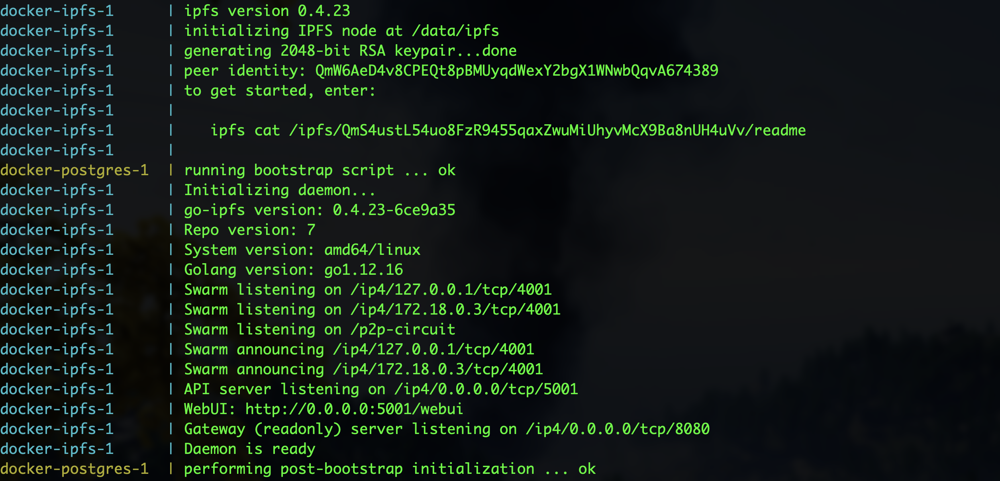

# Lux Town

### Pre Requisites

- Docker

### Local Setup

> Clone Lux Town

```bash
git clone https://github.com/luxdefi/luxtown.git
```

> Install and start your 👷‍ Hardhat chain

- Make sure to add a mnemonic at `packages/contracts/mnemonic.txt`

```bash
cd luxtown
yarn
yarn chain
```

> Start Docker and Local Graph Node

- The Docker container provides PostgreSQL and IPFS
- Make sure you Docker engine is running
- The first command spins up the container
- The second command builds and starts Graph Node separately
- The Graph Node connects to PostgreSQL and IPFS
- This will take a lot of time to build the first time

```bash
// On a new tab
yarn graphnode:docker
// On a new tab
yarn graphnode:start
```

> Successful Docker output
> 

> Successful Graph Node output
> 

> Start the Lux Town Subgraph

```bash
// On a new tab
yarn subgraph:prepare-local
yarn configure
yarn workspace @luxdefi/contracts add ts-node@10.3 --dev
yarn subgraph:start
```

> Successful Subgraph output
> 

> Build the SDK and Configure

- Running configure will mint a small number of NFTs for testing

```bash
// On a new tab
yarn build:sdk
yarn configure
```

> Start the App

```bash
yarn dev
```
